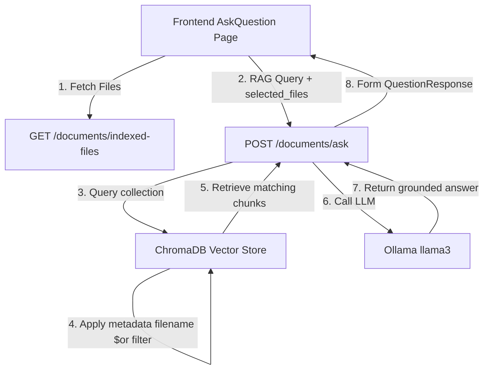

# File Selection Feature Report

## Overview
A document selection and targeting system has been implemented to allow users to focus their Q&A sessions on specific indexed files, rather than searching the entire database.

---

## Technical Architecture



### 1. File Listing API
* **Endpoint**: `GET /api/v1/documents/indexed-files`
* **Implementation**: Computes the list of unique files and counts the stored chunks for each file:
  ```python
  def get_indexed_files() -> list[dict]:
      # Fetches all metadatas, isolates unique filenames,
      # and performs counts per filename
  ```

### 2. Retrieval Filtering
* **Endpoint**: `POST /api/v1/documents/ask`
* **Schema**:
  ```json
  {
    "question": "What is the revenue?",
    "selected_files": ["2020_Annual_Report.docx"]
  }
  ```
* **Filter Application**: If `selected_files` contains filenames, the search engine utilizes ChromaDB's `where` filter:
  ```python
  where_clause = {
      "$or": [
          {"filename": {"$eq": fname}},
          {"drive_file_name": {"$eq": fname}},
          {"title": {"$eq": fname}}
      ]
  }
  ```

---

## UI Components & Design System

### 1. FileSelector Component
A component (`FileSelector.tsx`) was created to present:
* **Interactive List**: Checkboxes to select individual files or toggle "Select All Files".
* **Search / Filter Bar**: Search box to filter files dynamically by filename or category.
* **Pagination**: Lists up to 20 files at a time with a "Show More" option.
* **Metadata Badges**: Shows file type icons, document categories (policy, regulation, general), and the number of chunks indexed for each file.
