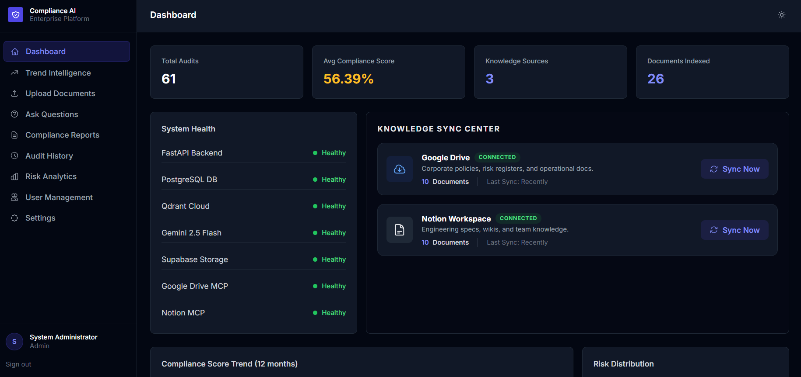
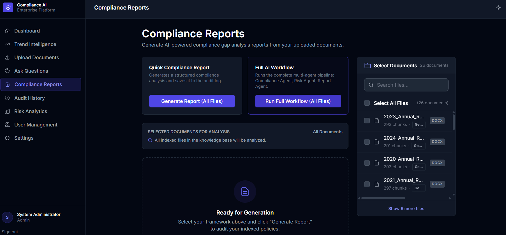
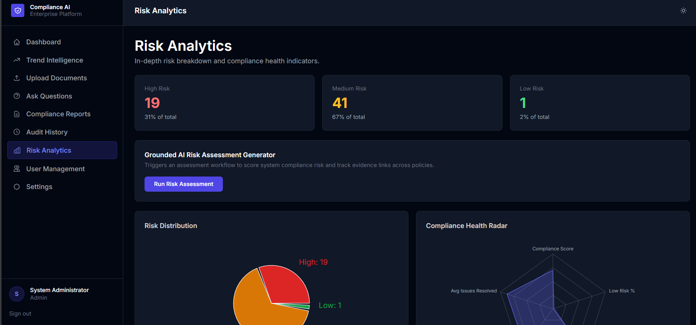
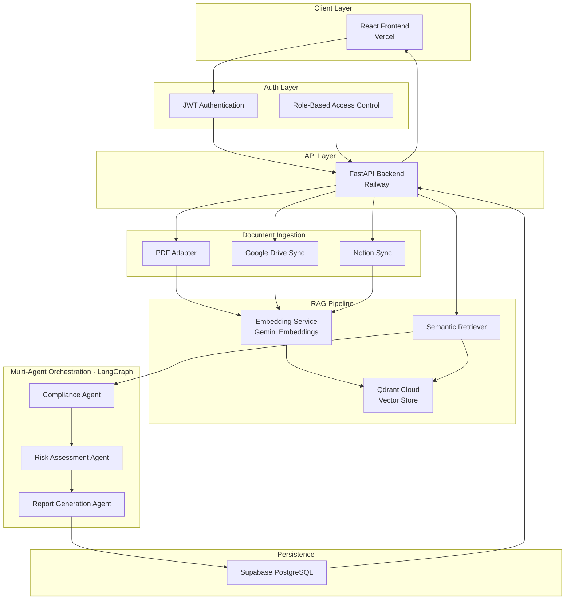
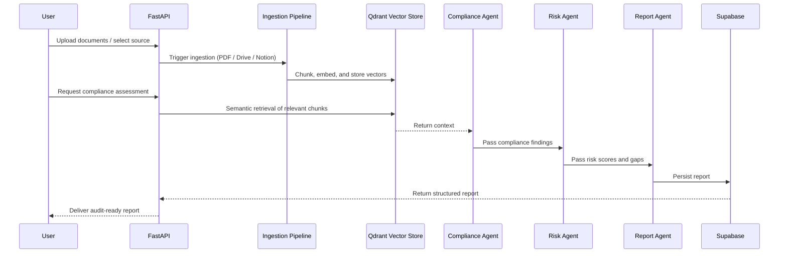

<div align="center">

# Enterprise Compliance & Audit Intelligence Platform

**AI-powered compliance analysis, risk assessment, and audit reporting — built on RAG and multi-agent orchestration.**

[](https://python.org)
[](https://fastapi.tiangolo.com)
[](https://react.dev)
[](https://github.com/langchain-ai/langgraph)
[](https://deepmind.google/technologies/gemini/)
[](https://supabase.com)
[](https://railway.app)
[](https://vercel.com)
[](LICENSE)

[Report Bug](https://github.com/Aadithya-kl/enterprise-compliance-ai/issues) · [Request Feature](https://github.com/Aadithya-kl/enterprise-compliance-ai/issues)

</div>

---
[](https://enterprise-compliance-ai-swart.vercel.app/login)

## Overview

Enterprise Compliance & Audit Intelligence Platform is a production-grade system that automates the analysis of organizational policies against regulatory frameworks using Retrieval-Augmented Generation (RAG) and a multi-agent AI architecture.

Instead of manually reviewing hundreds of policy documents against regulatory standards, compliance officers can ingest documents from PDF, Google Drive, or Notion, and receive AI-generated risk scores, gap analyses, and audit-ready reports — in minutes.

**Who is this for?**
- Compliance officers managing regulatory obligations (GDPR, SOC 2, ISO 27001, etc.)
- Legal and audit teams that need fast gap analysis across large document sets
- Organizations onboarding to new regulatory frameworks

---

## Screenshots


| Dashboard | Compliance Report | Risk Assessment |
|-----------|------------------|-----------------|
|  |  |  |

---

## Architecture



### Agent Workflow



---

## Features

- **Multi-source document ingestion** — PDF upload, Google Drive sync, Notion workspace sync via modular adapter pattern
- **Semantic search** — Qdrant vector store with Gemini embeddings for contextual retrieval across large document repositories
- **Multi-agent compliance analysis** — LangGraph-orchestrated agents for compliance checking, risk scoring, and report generation
- **Audit-ready reports** — structured outputs with risk scores, identified gaps, and remediation recommendations
- **JWT authentication and RBAC** — role-based access control for multi-user enterprise environments
- **MCP integrations** — Model Context Protocol for structured tool use by the LLM agents
- **Full-stack deployment** — FastAPI backend on Railway, React frontend on Vercel

---

## Tech Stack

| Layer | Technology |
|-------|-----------|
| Frontend | React 18, Tailwind CSS |
| Backend | Python 3.11, FastAPI |
| AI Model | Gemini 2.5 Flash |
| Agent Orchestration | LangGraph |
| Vector Store | Qdrant Cloud |
| Relational DB | Supabase (PostgreSQL) |
| Document Sources | PDF, Google Drive API, Notion API |
| Auth | JWT, RBAC |
| Backend Deployment | Railway |
| Frontend Deployment | Vercel |

---

## Getting Started

### Prerequisites

- Python 3.11+
- Node.js 18+
- A [Qdrant Cloud](https://cloud.qdrant.io) account (free tier works)
- A [Supabase](https://supabase.com) project
- A [Google AI Studio](https://aistudio.google.com) API key (Gemini)
- Google Drive API credentials (optional, for Drive sync)
- Notion API token (optional, for Notion sync)

### 1. Clone the repository

```bash
git clone https://github.com/Aadithya-kl/enterprise-compliance-ai.git
cd enterprise-compliance-ai
```

### 2. Backend setup

```bash
cd backend
python -m venv venv
source venv/bin/activate        # Windows: venv\Scripts\activate
pip install -r requirements.txt
```

Create a `.env` file in `/backend`:

```env
GEMINI_API_KEY=your_gemini_api_key
QDRANT_URL=https://your-cluster.qdrant.io
QDRANT_API_KEY=your_qdrant_api_key
SUPABASE_URL=https://your-project.supabase.co
SUPABASE_KEY=your_supabase_service_role_key
JWT_SECRET=your_jwt_secret
GOOGLE_CLIENT_ID=your_google_client_id          # optional
GOOGLE_CLIENT_SECRET=your_google_client_secret  # optional
NOTION_API_TOKEN=your_notion_token              # optional
```

Start the backend:

```bash
uvicorn main:app --reload --port 8000
```

API docs available at `http://localhost:8000/docs`

### 3. Frontend setup

```bash
cd frontend
npm install
```

Create a `.env.local` file in `/frontend`:

```env
NEXT_PUBLIC_API_URL=http://localhost:8000
```

Start the frontend:

```bash
npm run dev
```

Open `http://localhost:3000`

### 4. Docker Compose (recommended for local full-stack)

```bash
docker-compose up --build
```

---

## Deployment

### Backend — Railway

1. Connect your GitHub repository to [Railway](https://railway.app)
2. Set all environment variables from the `.env` template above in the Railway dashboard
3. Railway auto-detects the Python app and deploys on push to `main`

### Frontend — Vercel

1. Import the repository into [Vercel](https://vercel.com)
2. Set `NEXT_PUBLIC_API_URL` to your Railway backend URL
3. Vercel deploys automatically on push to `main`

---

## Project Structure

```
enterprise-compliance-ai/
├── backend/
│   ├── main.py                  # FastAPI application entry point
│   ├── agents/
│   │   ├── compliance_agent.py  # LangGraph compliance checking agent
│   │   ├── risk_agent.py        # Risk scoring and gap analysis agent
│   │   └── report_agent.py      # Audit report generation agent
│   ├── ingestion/
│   │   ├── pdf_adapter.py       # PDF document ingestion
│   │   ├── drive_adapter.py     # Google Drive sync
│   │   └── notion_adapter.py    # Notion workspace sync
│   ├── rag/
│   │   ├── embedder.py          # Gemini embedding pipeline
│   │   └── retriever.py         # Qdrant semantic search
│   ├── auth/
│   │   ├── jwt_handler.py       # JWT token management
│   │   └── rbac.py              # Role-based access control
│   └── requirements.txt
├── frontend/
│   ├── src/
│   │   ├── app/                 # Next.js app router pages
│   │   ├── components/          # React UI components
│   │   └── lib/                 # API client and utilities
│   └── package.json
├── docker-compose.yml
└── README.md
```

---

## Roadmap

- [ ] Support for additional regulatory frameworks (HIPAA, PCI-DSS, NIST)
- [ ] Slack and Microsoft Teams notifications for compliance alerts
- [ ] Scheduled automated compliance re-assessment
- [ ] Multi-tenant organization support
- [ ] Exportable audit reports in PDF and DOCX formats
- [ ] Audit trail and version history for document changes
- [ ] Fine-tuned compliance domain model

---

## Contributing

Contributions are welcome. Please open an issue before submitting a pull request for significant changes.

1. Fork the repository
2. Create a feature branch (`git checkout -b feature/your-feature`)
3. Commit your changes (`git commit -m 'Add your feature'`)
4. Push to the branch (`git push origin feature/your-feature`)
5. Open a Pull Request

---

## Author

**K L Aadithya**
B.Tech Computer Science and Data Science, Sai University

[](https://github.com/Aadithya-kl)
[](https://www.linkedin.com/in/k-l-aadithya-62b018295)

---
**Shrinidhi**
B.Tech Computer Science and Data Science, Sai University

[](https://github.com/shrinithisk)


---
**Sankeerthana**
B.Tech Computer Science and Data Science, Sai University

[](https://github.com/KoletiSankeerthana)


---
## License

Distributed under the MIT License. See `LICENSE` for more information.
