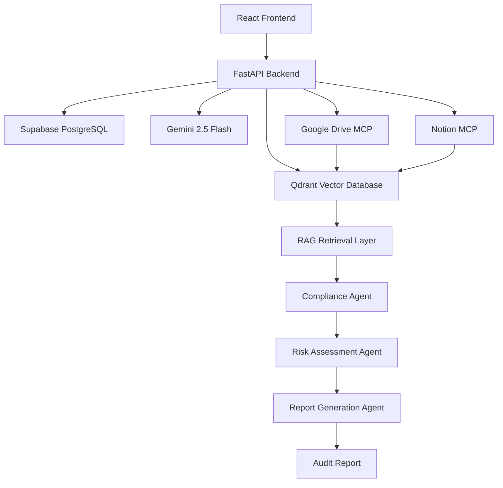

#  Enterprise Compliance AI

### Autonomous Enterprise Compliance & Audit Intelligence Platform

An AI-powered compliance intelligence platform that automates policy analysis, regulatory gap detection, risk assessment, and audit reporting using Retrieval-Augmented Generation (RAG), Multi-Source Knowledge Sync, and Agentic AI Workflows.

---

##  Live Deployment

**Frontend (Vercel)**
https://enterprise-compliance-ai-swart.vercel.app

**Backend API (Railway)**
https://enterprise-compliance-ai-production.up.railway.app

**API Documentation**
https://enterprise-compliance-ai-production.up.railway.app/docs

---

##  Overview

Enterprise organizations store compliance documents across multiple systems including Google Drive, Notion, internal repositories, and policy management platforms.

During audits, compliance teams spend significant time locating documents, validating regulatory requirements, identifying gaps, and generating reports.

Enterprise Compliance AI automates this process through:

* Intelligent document ingestion
* AI-powered compliance analysis
* Risk scoring and violation detection
* Multi-source knowledge synchronization
* Automated audit report generation
* Enterprise-grade RBAC security

---

##  Key Features

###  AI Compliance Analysis

* Regulatory gap assessment
* Compliance score generation
* Risk classification
* Violation detection
* AI-generated remediation recommendations

###  Multi-Source Knowledge Sync

* Google Drive Integration
* Notion Workspace Integration
* Local Document Uploads
* Incremental synchronization
* Duplicate detection

###  Retrieval Augmented Generation (RAG)

* Semantic document search
* Context-aware compliance analysis
* Source attribution
* Intelligent document retrieval

###  Executive Dashboard

* Compliance KPIs
* Audit metrics
* Risk distribution analytics
* System health monitoring
* Knowledge source statistics

###  Enterprise Security

* JWT Authentication
* Role-Based Access Control (RBAC)
* User Management
* Protected API Endpoints

###  Audit Reporting

* Compliance Reports
* Risk Reports
* Violation Tracking
* Audit History
* Exportable Results

---

##  System Architecture

---

##  Technology Stack

### Frontend

* React 19
* TypeScript
* Vite
* Tailwind CSS
* React Query
* Recharts

### Backend

* FastAPI
* Python 3.11
* SQLAlchemy
* Pydantic
* JWT Authentication

### AI & Data

* Google Gemini 2.5 Flash
* LangGraph
* Qdrant Cloud
* Sentence Transformers
* RAG Architecture

### Integrations

* Google Drive API
* Notion API
* MCP Connectors

### Infrastructure

* Railway
* Vercel
* Supabase PostgreSQL
* Docker

---

##  Core Workflow

1. Documents are uploaded or synced from external sources.
2. Content is extracted and chunked.
3. Embeddings are generated.
4. Chunks are stored in Qdrant Cloud.
5. User initiates compliance analysis.
6. Relevant context is retrieved through RAG.
7. AI agents evaluate compliance status.
8. Risk scores and violations are generated.
9. Reports are stored and visualized on the dashboard.

---

## 📸 Platform Screenshots

### Authentication

Add screenshot here

### Dashboard

Add screenshot here

### Knowledge Sync Center

Add screenshot here

### Compliance Reports

Add screenshot here

### Risk Analytics

Add screenshot here

---

##  API Endpoints

| Endpoint                 | Method | Description           |
| ------------------------ | ------ | --------------------- |
| /api/v1/auth/register    | POST   | Register User         |
| /api/v1/auth/login       | POST   | Login                 |
| /api/v1/auth/me          | GET    | Current User          |
| /api/v1/documents/upload | POST   | Upload Documents      |
| /api/v1/documents/ask    | POST   | Ask Questions via RAG |
| /api/v1/users            | GET    | User Management       |
| /api/v1/reports          | GET    | Audit Reports         |

---

##  Future Roadmap

* Microsoft SharePoint Integration
* Slack & Microsoft Teams Alerts
* Real-Time Audit Monitoring
* Regulatory Framework Templates
* Advanced Multi-Agent Workflows
* Explainable AI Compliance Reasoning

---

##  Team

### Aadithya K L

### Shrinidhi

### Sankeerthana

---

##  Project Status

Production Deployment Active

Frontend: Vercel
Backend: Railway
Database: Supabase
Vector Database: Qdrant Cloud
